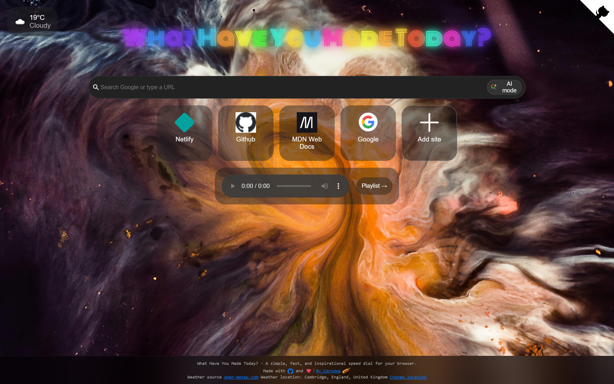

# What Have You Made Today? - A simple, fast, and inspirational speed dial for your browser.

You can:
- Add favorites
- See source code with github corner
- Look at weather
- Play music with your playlist
- Search Google or type a URL
- Or use AI mode for a in-depth search
- And last but not least use a browser extention to really make it a new tab page.

[inspirational-new-tab.netlify.app](https://inspirational-new-tab.netlify.app)

# Licence / sources

Code on terms of the [MIT Licence](LICENCE)

Weather source: [open-meteo.com](https://open-meteo.com)

Github Corners [Copyright (c) 2025 Tim Holman](https://tholman.com/github-corners/)

Weather symbols stolen from [Met Office](https://weather.metoffice.gov.uk/guides/what-does-this-forecast-mean)